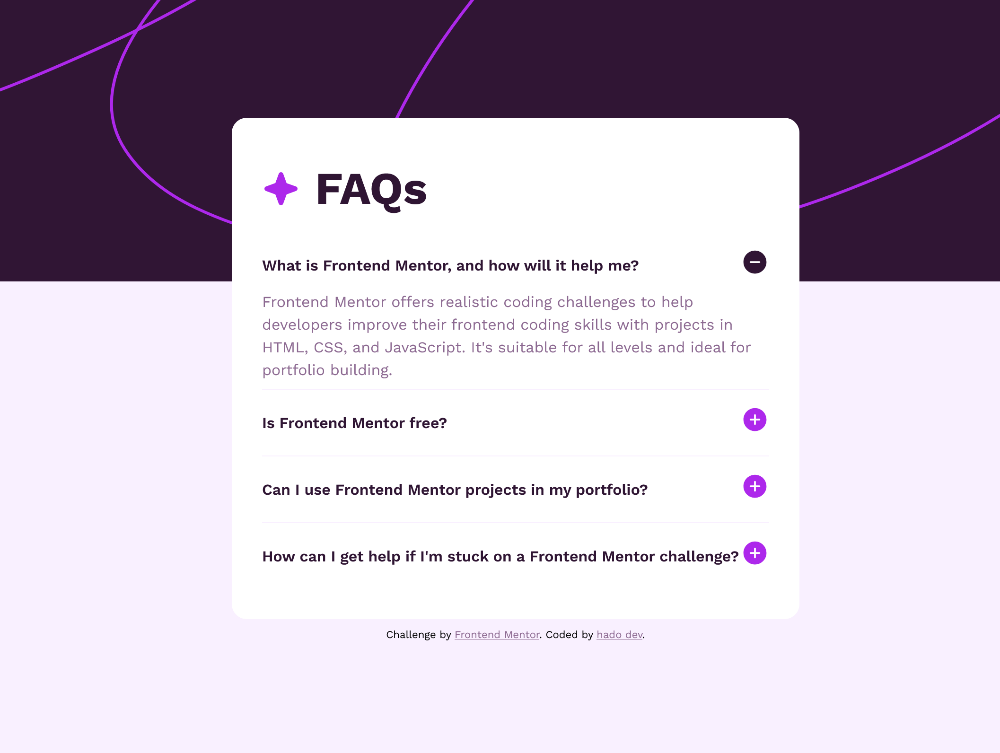

# Frontend Mentor - FAQ accordion solution

This is a solution to the [FAQ accordion challenge on Frontend Mentor](https://www.frontendmentor.io/challenges/faq-accordion-wyfFdeBwBz). Frontend Mentor challenges help you improve your coding skills by building realistic projects. 

## Table of contents

- [Overview](#overview)
  - [The challenge](#the-challenge)
  - [Screenshot](#screenshot)
  - [Links](#links)
- [My process](#my-process)
  - [Built with](#built-with)
  - [What I learned](#what-i-learned)
  - [Continued development](#continued-development)
  - [Useful resources](#useful-resources)
- [Author](#author)
- [Acknowledgments](#acknowledgments)

**Note: Delete this note and update the table of contents based on what sections you keep.**

## Overview

### The challenge

Users should be able to:

- Hide/Show the answer to a question when the question is clicked
- Navigate the questions and hide/show answers using keyboard navigation alone
- View the optimal layout for the interface depending on their device's screen size
- See hover and focus states for the questions

### Screenshot

#### Desktop screenshot

#### Mobile screenshot

### Links

- Solution URL: [Add solution URL here](https://your-solution-url.com)
- Live Site URL: [Add live site URL here](https://your-live-site-url.com)

## My process

### Built with

- Semantic HTML5 markup
- Vanilla CSS
- CSS custom properties for colors
- Flexbox for summary tag
- CSS Grid for body tag
- Responsive design based on clamp() function

### Useful resources

- [CSS reset](https://piccalil.li/blog/a-more-modern-css-reset/) - Modern CSS reset.
- [Image compressor] (https://imagecompressor.com/) - This online image optimizer uses a smart combination of the best optimization and lossy compression algorithms to shrink JPEG, GIF and PNG images to the minimum possible size while keeping the required level of quality.
- [@font-face generator] (https://transfonter.org/) - Modern and simple css @font-face generator.

## Author

- GitHub - [Hado Dev](https://piccalil.li/blog/a-more-modern-css-reset/)
- Frontend Mentor - [@hadodev](https://www.frontendmentor.io/profile/yourusername)

## Acknowledgments

For all authors who publish open source ressources and contents freely available and make Internet more awesome.
